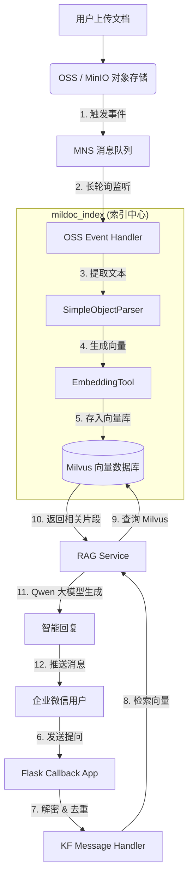

# MilDoc - 文档智能问答系统

# 项目演示

**转人工服务：**

<br />

<br />

<br />

**测试阶段上传了《大模型就业现况研究》的pdf文档：**

<br />


**项目流程图**

<br />

## 项目背景与目标

MilDoc是一个基于**RAG（Retrieval-Augmented Generation）架构**的企业级文档智能问答系统，旨在为企业提供高效、准确的知识库问答服务。

**核心目标**：

- 实现文档的自动化索引和向量化存储
- 提供基于企业微信的智能客服能力
- 支持多种文档格式（PDF、Office、Markdown等）
- 实现实时文档更新同步机制

***

## 技术栈选型及理由

| 技术组件      | 选型             | 选型理由                        |
| --------- | -------------- | --------------------------- |
| **编程语言**  | Python 3.10+   | 生态成熟，AI/ML库丰富，开发效率高         |
| **对象存储**  | MinIO / 阿里云OSS | 支持S3协议，事件通知机制完善，适合文档存储和实时监听 |
| **向量数据库** | Milvus         | 开源向量数据库领导者，支持高效向量检索，社区活跃    |
| **RAG框架** | LangChain      | 模块化设计，支持多种向量存储和LLM集成，灵活性强   |
| **大语言模型** | OpenAI兼容API    | 支持多种模型切换，通过API调用降低部署复杂度     |
| **客服渠道**  | 企业微信API        | 企业级即时通讯渠道，支持消息回调和会话管理       |

***

## 系统架构设计

### 整体架构图

```
┌─────────────────────────────────────────────────────────────────────────┐
│                        客户端层                                         │
│   ┌───────────────────────┐                                            │
│   │   企业微信客户端       │                                            │
│   └───────────┬───────────┘                                            │
└───────────────│─────────────────────────────────────────────────────────┘
                │ HTTPS (消息回调)
                ▼
┌─────────────────────────────────────────────────────────────────────────┐
│                        接入层 (mildoc_wxkf)                             │
│   ┌───────────────────────┐   ┌───────────────────────┐                │
│   │  wxkf_callback_app.py │   │   wecom_api.py        │                │
│   │  (消息回调处理)        │   │   (企业微信API封装)   │                │
│   └───────────┬───────────┘   └───────────┬───────────┘                │
│               │                           │                             │
│               ▼                           ▼                             │
│   ┌───────────────────────┐   ┌───────────────────────┐                │
│   │kf_message_handler.py  │   │   cursor_manager.py   │                │
│   │  (消息分发与处理)      │   │   (游标管理去重)       │                │
│   └───────────┬───────────┘   └───────────────────────┘                │
│               │                                                         │
│               ▼                                                         │
│   ┌───────────────────────┐   ┌───────────────────────┐                │
│   │    rag_service.py     │◄──│  rerank_service.py    │                │
│   │  (RAG核心问答服务)     │   │   (重排序优化)        │                │
│   └───────────┬───────────┘   └───────────────────────┘                │
└───────────────│─────────────────────────────────────────────────────────┘
                │ gRPC/REST
                ▼
┌─────────────────────────────────────────────────────────────────────────┐
│                        数据层 (mildoc_index)                            │
│   ┌───────────────────────┐   ┌───────────────────────┐                │
│   │minio_event_handler.py │   │  oss_event_handler.py │                │
│   │  (MinIO事件监听)       │   │  (OSS事件监听)        │                │
│   └───────────┬───────────┘   └───────────┬───────────┘                │
│               │                           │                             │
│               ▼                           ▼                             │
│   ┌───────────────────────────────────────────────────┐                │
│   │              SimpleObjectParser                    │                │
│   │  ┌─────┐ ┌─────────┐ ┌───────┐ ┌─────────┐       │                │
│   │  │PDF  │ │Office   │ │Markdown│ │Text    │       │                │
│   │  │Parser││Parser   │ │Parser │ │Parser  │       │                │
│   │  └──┬──┘ └────┬────┘ └───┬───┘ └────┬────┘       │                │
│   │     │         │          │          │             │                │
│   └─────│─────────│──────────│──────────│─────────────┘                │
│         ▼         ▼          ▼          ▼                              │
│   ┌───────────────────────────────────────────────────┐                │
│   │            embedding.py                           │                │
│   │       (OpenAI Embedding API)                      │                │
│   └───────────────────┬───────────────────────────────┘                │
│                       ▼                                               │
│   ┌───────────────────────────────────────────────────┐                │
│   │            milvus_api.py                          │                │
│   │       (Milvus向量存储与检索)                        │                │
│   └───────────────────────────────────────────────────┘                │
└─────────────────────────────────────────────────────────────────────────┘
                              │
                              ▼
┌─────────────────────────────────────────────────────────────────────────┐
│                        存储层                                           │
│   ┌───────────┐         ┌───────────┐         ┌───────────┐            │
│   │   MinIO   │         │  Milvus   │         │   SQLite  │            │
│   │ (文档存储)│         │(向量索引) │         │(游标状态) │            │
│   └───────────┘         └───────────┘         └───────────┘            │
└─────────────────────────────────────────────────────────────────────────┘
```

### 模块职责说明

| 模块         | 文件                                                | 职责                            |
| ---------- | ------------------------------------------------- | ----------------------------- |
| **事件监听层**  | `minio_event_handler.py` / `oss_event_handler.py` | 监听对象存储事件，触发文档处理流程             |
| **文档解析层**  | `parser/*.py`                                     | 支持PDF、Office、Markdown等多格式文档解析 |
| **向量生成层**  | `embedding.py`                                    | 调用Embedding API生成文本向量         |
| **向量存储层**  | `milvus_api.py`                                   | Milvus集合管理、向量插入与检索            |
| **RAG服务层** | `rag_service.py`                                  | 检索+重排序+LLM生成的完整问答链路           |
| **客服处理层**  | `kf_message_handler.py`                           | 企业微信消息接收、分发与回复                |
| **状态管理层**  | `cursor_manager.py`                               | 消息去重、游标持久化                    |

***

## 核心功能模块实现细节

### 1. 文档索引服务 (mildoc\_index)

#### 三种运行模式

```python
# main.py 支持三种模式
--mode full-refresh   # 全量刷新：遍历所有文档重建索引
--mode backfill       # 排查补漏：检查缺失文档并补充
--mode listen         # 增量更新：实时监听对象存储事件
```

#### 事件处理流程

```
MinIO事件 → _extract_event_info() → _process_event()
    ↓
ObjectCreated → _handle_object_created() → _process_single_object()
    ↓
parse_object() → get_embedding() → insert_document()
```

**关键设计**：

- **增量更新机制**：通过MinIO `listen_bucket_notification`实现实时事件监听
- **幂等性保证**：文档路径作为唯一标识，支持重复触发时的去重处理
- **事务性操作**：全量刷新时先删除旧记录再插入新记录，保证数据一致性

### 2. 向量数据库交互 (milvus\_api.py)

#### 集合Schema设计

| 字段                | 类型                  | 说明         |
| ----------------- | ------------------- | ---------- |
| `id`              | INT64               | 主键，自动生成    |
| `doc_name`        | VARCHAR(500)        | 文档名称       |
| `doc_path_name`   | VARCHAR(1000)       | 文档路径（唯一标识） |
| `doc_type`        | VARCHAR(50)         | 文档类型       |
| `doc_md5`         | VARCHAR(32)         | 文档MD5校验值   |
| `doc_length`      | INT64               | 文档字节数      |
| `content`         | VARCHAR(65535)      | 文档分段内容     |
| `content_vector`  | FLOAT\_VECTOR(1536) | 内容向量       |
| `embedding_model` | VARCHAR(100)        | 嵌入模型名称     |

#### 索引优化策略

```python
# IVF_FLAT索引，适合中小规模数据集
index_params.add_index(
    field_name="content_vector",
    index_type="IVF_FLAT",
    metric_type="COSINE",
    params={"nlist": 1024}  # 聚类数量
)

# 搜索参数优化
search_params = {
    "metric_type": "COSINE",
    "params": {"nprobe": 64}  # 搜索时扫描的聚类数（nlist的6.25%）
}
```

### 3. RAG问答服务 (rag\_service.py)

#### 核心查询流程

```
用户提问 → 向量检索(Top-10) → Rerank重排序(Top-5) → LLM生成回答
```

**关键技术点**：

1. **双层检索策略**：
   - 第一层：Milvus向量检索获取候选文档
   - 第二层：Rerank服务基于语义相关性重排序
2. **安全检查机制**：
   ```python
   # 确保原始最高相似度文档不会被完全过滤
   if not first_doc_in_rerank:
       first_doc.metadata['rerank_score'] = 1.0
       reranked_docs.insert(0, first_doc)
   ```
3. **场景检测功能**：
   - 支持6种客服场景分类（产品咨询、售后服务、账户相关、投诉建议、技术支持、其他）
   - 根据场景类型决定是否建议转人工客服

***

## 关键技术难点及解决方案

**问题**：企业微信消息可能重复推送，导致重复回复

**解决方案**：

- **双重去重**：内存缓存（快速通道）+ 数据库持久化（安全兜底）
- 消息ID作为唯一标识
- 内存缓存大小限制（1000条），超过时清理一半

```python
# kf_message_handler.py
if msgid in self.processed_messages or cursor_manager.is_message_processed(msgid):
    continue  # 跳过已处理消息
```

<br />

***

## 性能优化策略

### 1. 批量处理优化

```python
# embedding.py 支持批量生成
def get_embeddings_batch(self, texts: List[str]) -> List[List[float]]:
    response = self.client.embeddings.create(
        model=self.model,
        input=texts,  # 批量输入
        dimensions=self.dimensions
    )
    return [data.embedding for data in response.data]
```

### 2. 索引预热

```python
# milvus_api.py
def _load_collection(self) -> bool:
    self.client.load_collection(collection_name=self.collection_name)
    return True
```

### 3. 异步事件监听

```python
# minio_event_handler.py
events = self.minio_client.listen_bucket_notification(
    bucket_name=self.bucket_name,
    events=['s3:ObjectCreated:*', 's3:ObjectRemoved:*']
)
```

### 4. 日志分级与监控

- 使用`logging`模块实现分级日志
- 集成Langfuse进行LLM调用监控
- 记录Token使用情况，便于成本控制

***

## 代码质量保障措施

### 测试覆盖

```
mildoc_index/test/
├── test-milvus_api.py    # Milvus API测试
├── test-oss_event_handler.py  # OSS事件处理测试
└── test-embedding.py     # Embedding功能测试
```

**测试策略**：

- 单元测试：覆盖核心API方法
- 集成测试：验证端到端流程
- Mock外部服务：避免测试依赖外部API

### CI/CD流程

```
代码提交 → 自动测试 → 代码审查 → 部署
```

**关键检查点**：

- 语法检查（flake8）
- 类型检查（mypy）
- 测试覆盖率（coverage）
- 安全扫描（bandit）

### 配置管理

- 使用`.env`文件管理敏感配置
- 通过`Config`类集中管理配置项
- 支持配置验证方法

```python
@classmethod
def validate_config(cls):
    errors = []
    if not cls.TOKEN:
        errors.append("缺少TOKEN配置")
    # ... 更多验证
    return errors
```

***

## 项目亮点与创新点

### 1. 多存储提供商支持

同时支持MinIO和阿里云OSS，通过`--provider`参数切换，实现多云部署能力

### 2. 智能重排序机制

引入Rerank服务提升检索精度，同时保留原始相似度最高文档作为安全兜底

### 3. 场景感知能力

通过LLM进行场景分类，支持智能转人工策略，提升用户体验

### 4. 完善的错误处理

- 多层异常捕获
- 详细的日志记录
- 优雅降级策略

### 5. 可观测性设计

- Token使用统计
- 检索耗时监控
- 健康检查接口

***

## 未来可扩展性分析

### 1. 支持更多文档格式

- 增加图片OCR解析能力
- 支持CAD图纸、流程图等专业格式
- 支持音视频内容转写

### 2. 多模态检索

- 支持图片检索（CLIP模型）
- 支持语音问答
- 多模态融合检索

### 3. 分布式扩展

- 支持Milvus集群部署
- 引入消息队列（Kafka/RabbitMQ）解耦事件处理
- 支持水平扩展的文档解析集群

### 4. 知识图谱集成

- 将结构化知识转化为图谱
- 支持多跳推理问答
- 实现知识补全和推理能力

### 5. 模型优化

- 引入LoRA微调技术
- 支持模型量化部署
- 实现模型热更新

***

## 快速开始

### 环境要求

- Python 3.10+
- MinIO / 阿里云OSS
- Milvus 2.x
- OpenAI兼容API

### 配置文件

```env
# .env 文件示例
MINIO_ENDPOINT=localhost:9000
MINIO_ACCESS_KEY=minioadmin
MINIO_SECRET_KEY=minioadmin
MINIO_BUCKET=mildoc

MILVUS_HOST=localhost
MILVUS_PORT=19530
MILVUS_COLLECTION=mildoc_docs
MILVUS_VECTOR_DIM=1536

OPENAI_API_KEY=your-api-key
OPENAI_BASE_URL=https://api.example.com/v1
EMBEDDING_MODEL=text-embedding-3-small
```

### 运行命令

```bash
# 全量刷新模式
python main.py --provider minio --mode full-refresh

# 排查补漏模式
python main.py --provider minio --mode backfill

# 增量更新模式
python main.py --provider minio --mode listen
```

***

## 项目结构

```
mildoc/
├── mildoc_index/           # 文档索引服务
│   ├── parser/            # 文档解析器
│   │   ├── document_parser.py    # 抽象基类
│   │   ├── pdf_parser.py         # PDF解析
│   │   ├── office_parser.py      # Office解析
│   │   ├── markdown_parser.py    # Markdown解析
│   │   ├── text_parser.py        # 文本解析
│   │   └── simple_object_parser.py  # 统一解析入口
│   ├── logger/            # 日志配置
│   ├── test/              # 测试文件
│   ├── main.py            # 入口脚本
│   ├── embedding.py       # Embedding工具
│   ├── milvus_api.py      # Milvus交互
│   ├── minio_event_handler.py    # MinIO事件处理
│   └── oss_event_handler.py      # OSS事件处理
├── mildoc_wxkf/           # 企业微信客服服务
│   ├── admin_app.py       # 管理后台
│   ├── wxkf_callback_app.py      # 消息回调入口
│   ├── kf_message_handler.py     # 消息处理器
│   ├── wecom_api.py       # 企业微信API封装
│   ├── WXBizMsgCrypt.py   # 消息加密
│   ├── rag_service.py     # RAG问答服务
│   ├── rerank_service.py  # 重排序服务
│   ├── cursor_manager.py  # 游标管理
│   └── config.py          # 配置管理
└── README.md              # 项目文档
```

***

## 个人贡献说明

作为该项目的核心开发者，主要贡献包括：

1. **架构设计**：设计了完整的RAG系统架构，包括事件监听、文档解析、向量存储、问答服务等模块
2. **核心模块实现**：
   - 实现了MinIO/OSS事件监听机制
   - 设计并实现了Milvus向量数据库交互层
   - 实现了基于LangChain的RAG服务
   - 完成了企业微信客服消息处理逻辑
3. **技术优化**：
   - 实现了双重消息去重机制
   - 设计了智能重排序策略
   - 优化了向量检索性能参数
4. **工程实践**：
   - 建立了完善的配置管理体系
   - 实现了详细的日志和监控机制
   - 编写了测试内容
5. **文档规范**：
   - 编写了代码注释和模块说明
   - 设计了API接口规范
   - 建立了配置文档

该项目展示了在企业级AI应用开发方面的技术能力，包括系统设计、性能优化、工程实践等多个维度。
